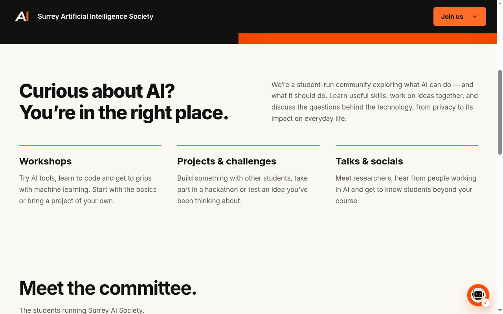
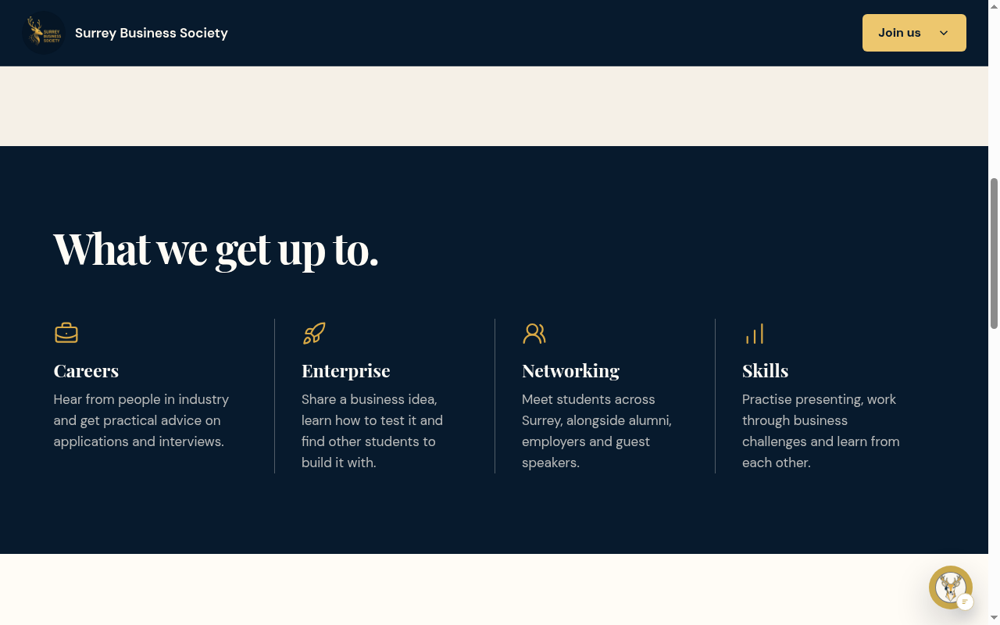
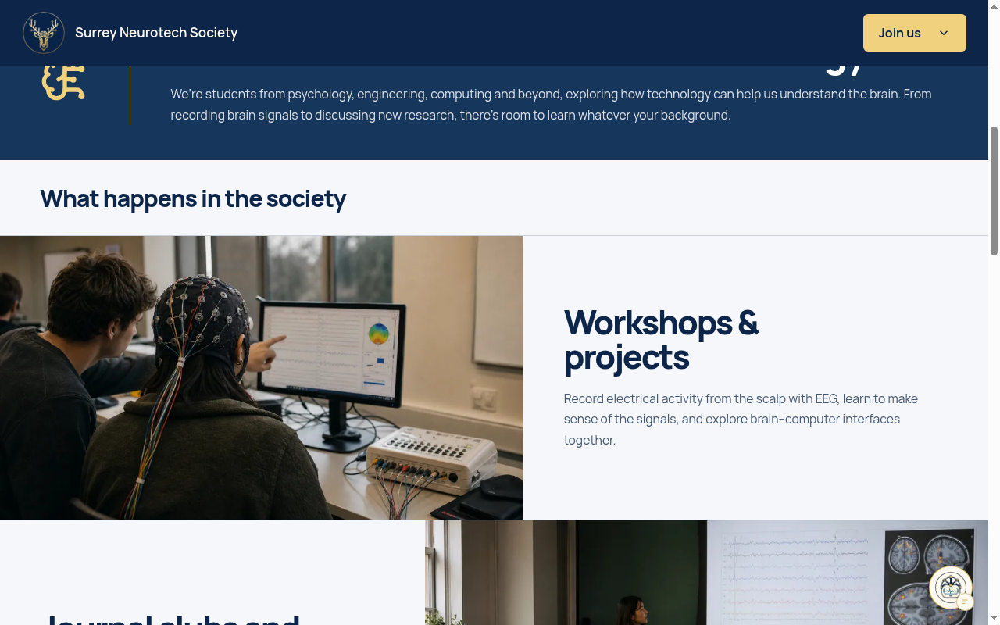

<div align="center">

# surreysocieties

**Three University of Surrey society websites. One monorepo.**

Campus energy, shared infrastructure, production-ready Astro apps.

<br />

<p>
  <a href="https://surreyaisociety.org">AI</a> ·
  <a href="https://surreybusinesssociety.org">Business</a> ·
  <a href="https://surreyneurotechsociety.org">Neurotech</a>
</p>

</div>

---

<p align="center">
  
  
  
</p>

<p align="center">
  
  
  
</p>

## What this is

`surreysocieties` is an npm-workspaces monorepo for three student society sites at the University of Surrey. Each society has its own Astro app, brand, and production domain; they share Convex backend functions, Clerk auth, admin tooling, and UI packages.

| Society | App | Domain | Dev port |
|---------|-----|--------|----------|
| Surrey Artificial Intelligence Society | `apps/ai` | [surreyaisociety.org](https://surreyaisociety.org) | `4321` |
| Surrey Business Society | `apps/business` | [surreybusinesssociety.org](https://surreybusinesssociety.org) | `4322` |
| Surrey Neurotech Society | `apps/neurotech` | [surreyneurotechsociety.org](https://surreyneurotechsociety.org) | `4323` |

## Stack

- **Framework:** [Astro](https://astro.build/) (SSR with Node adapter)
- **Styling:** [Tailwind CSS v4](https://tailwindcss.com/)
- **Backend:** [Convex](https://convex.dev/) (database, queries, mutations)
- **Auth:** [Clerk](https://clerk.com/) (sign-in, JWT for Convex)
- **Language:** TypeScript
- **Monorepo:** npm workspaces (`apps/*`, `packages/*`)
- **Deploy:** [Vercel](https://vercel.com/) via `scripts/build-vercel.mjs` (per-society Build Output API bundle)

## Local setup

### Prerequisites

- Node.js `>= 22.12.0`
- A [Convex](https://convex.dev/) account and project
- A [Clerk](https://clerk.com/) application

### Install and backend

```bash
npm install
npx convex dev
```

`convex dev` links the project, generates `_generated/` types, and deploys functions.

In the Convex dashboard, open **Settings → Authentication**, add Clerk, and enter your Clerk publishable key.

### Seed and protected admins

```bash
npx convex run seed:seedSocieties
```

This creates the three societies and their protected admin membership records. Create Clerk accounts for these emails; on first sign-in, Convex links the Clerk identity to the existing user record:

| Society | Email |
|---------|-------|
| Surrey AI Society | `ussu.aianddatascience@surrey.ac.uk` |
| Business Society | `ussu.bizsoc@surrey.ac.uk` |
| Neurotech Society | `ussu.neurotechsoc@surrey.ac.uk` |

### Environment

Copy [`.env.example`](.env.example) into a root `.env` (or per-app `.env.local`) and fill in:

```bash
CONVEX_URL=https://your-project.convex.cloud
CONVEX_SITE_URL=https://your-project.convex.site
CLERK_JWT_ISSUER_DOMAIN=https://your-clerk-domain.clerk.accounts.dev
PUBLIC_CLERK_PUBLISHABLE_KEY=pk_test_...
CLERK_SECRET_KEY=sk_test_...
CSRF_SECRET=replace-with-a-long-random-string
```

Optional contact delivery (server-only; without both values the form prepares a mailto draft):

```bash
RESEND_API_KEY=
CONTACT_FROM_EMAIL=
```

Optional public AI assistant:

```bash
GEMINI_API_KEY=
AI_FEATURES_ENABLED=true
AI_MODEL=gemini-3.1-flash-lite
AI_FALLBACK_MODEL=gemini-3.1-flash-lite
ASSISTANT_RATE_LIMIT_SECRET=replace-with-a-second-long-random-string
AGENT_BUILDS_SERVER_SECRET=replace-with-a-third-long-random-string
```

**Server-only secrets:** `GEMINI_API_KEY`, `CLERK_SECRET_KEY`, `ASSISTANT_RATE_LIMIT_SECRET`, `AGENT_BUILDS_SERVER_SECRET`, `RESEND_API_KEY`, and `CONTACT_FROM_EMAIL` must never use a `PUBLIC_` prefix. Set the same assistant rate-limit secret in every Astro deployment and Convex. The assistant enables automatically when `GEMINI_API_KEY` is set unless `AI_FEATURES_ENABLED=false`.

### Develop, build, test

```bash
npm run dev:ai         # http://localhost:4321
npm run dev:business   # http://localhost:4322
npm run dev:neurotech  # http://localhost:4323

npm run build:ai
npm run build:business
npm run build:neurotech
npm run build:all

npm test               # Vitest unit suite
npm run test:e2e       # Playwright (ports 4321–4323)
```

## Project map

```
surreysocieties/
├── apps/
│   ├── ai/              # Surrey AI Society
│   ├── business/        # Surrey Business Society
│   └── neurotech/       # Surrey Neurotech Society
├── packages/
│   ├── admin/           # Shared admin config, validation, Convex client
│   └── ui/              # Shared Astro components
├── convex/              # Shared backend (schema, functions, permissions, seed)
├── scripts/             # Deploy helpers (e.g. build-vercel.mjs) and ops scripts
├── e2e/                 # Playwright tests
└── package.json         # Workspace root
```

## Admin notes

Each site’s `/admin` area is gated by Clerk auth and Convex membership checks. Societies are isolated: a member of one society cannot access another’s admin tools.

| Role | Access |
|------|--------|
| `protectedAdmin` | Society inbox admin. Full access; cannot be removed or demoted. |
| `admin` | Content, invites, and role changes. |
| `member` | Events and committee; cannot manage users. |

Provision protected Clerk accounts (and refresh the Convex JWT template) with:

```bash
npm run provision:admins
```

Requires `CLERK_SECRET_KEY` plus `OWNER_ADMIN_INITIAL_PASSWORD`, `AI_ADMIN_INITIAL_PASSWORD`, `BUSINESS_ADMIN_INITIAL_PASSWORD`, and `NEUROTECH_ADMIN_INITIAL_PASSWORD`.

## Deploy

- Deploy each Astro app as Node SSR from its workspace build. On Vercel, build from the repo root with `node scripts/build-vercel.mjs ai|business|neurotech` and output `.vercel/output`.
- Point each production domain at the matching app and keep env vars in that deployment environment.
- Deploy Convex functions against the same project as `CONVEX_URL`.
- Configure Clerk’s Convex JWT template named `convex` (audience `convex`). Keep `CSRF_SECRET` stable across rollouts.

## Contributing

Issues and pull requests that improve shared packages, society isolation, tests, or deploy reliability are welcome. Keep society-specific content accurate — do not invent committee or event facts. Prefer proving changes with `npm test`, `npm run test:e2e`, and the relevant `build:*` script.
