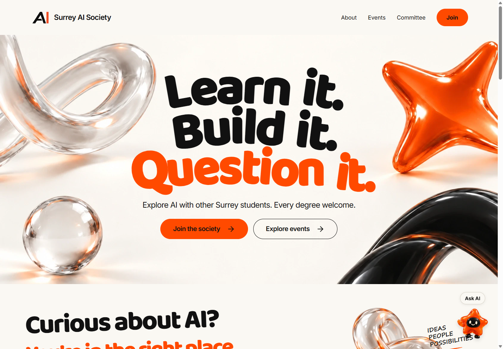
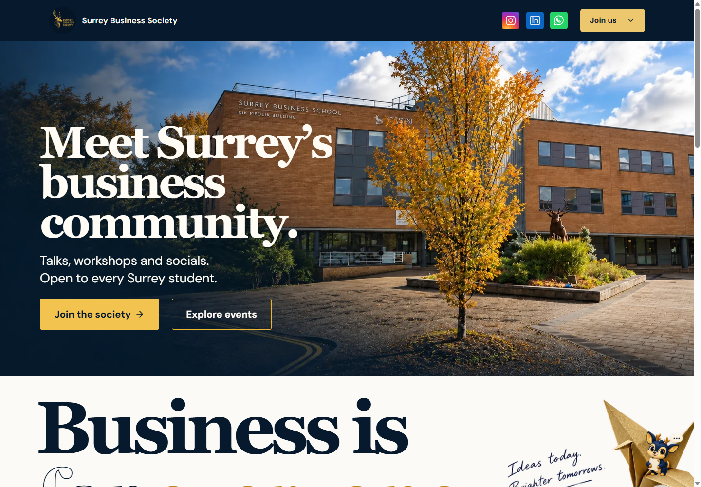
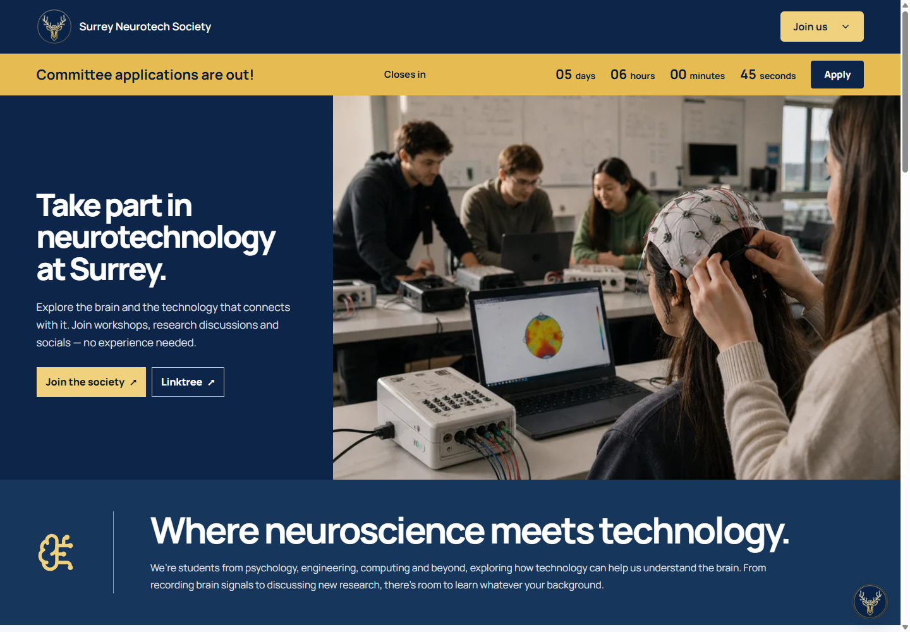

# Surrey Societies

Three student communities at the University of Surrey, each with a website of its own. Discover what they do, explore events and find your way to get involved.

[AI Society](https://surreyaisociety.org) · [Business Society](https://surreybusinesssociety.org) · [Neurotech Society](https://surreyneurotechsociety.org)

## AI Society

A community for students curious about artificial intelligence, machine learning and data science. Learn together, build projects and ask questions, whatever your degree or experience.

[Visit the AI site →](https://surreyaisociety.org)



## Business Society

Meet Surrey’s business community through careers, enterprise, networking and practical skills. A place to exchange ideas, meet other students and take your next step.

[Visit the Business site →](https://surreybusinesssociety.org)



## Neurotech Society

Explore where neuroscience meets technology through workshops, brain–computer interface projects, research discussions and socials. No previous experience needed.

[Visit the Neurotech site →](https://surreyneurotechsociety.org)



*Screenshots captured from all three live websites on 9 October 2026.*

## About the project

The sites bring each society’s activities, committee and membership links together in one place. Each keeps its own look and personality, with shared foundations that make it easier to maintain all three.

## Contributing

Ideas, corrections and improvements are welcome. Keep society information accurate and check changes on both desktop and mobile. The project’s [working guide](AGENTS.md) covers where things live and which checks to run.

<details>
<summary>For developers: run the sites locally</summary>

Use Node.js 22.12 or newer. Install dependencies, copy [.env.example](.env.example) to `.env` and configure your own Convex project:

```sh
npm install
npx convex dev
```

Start the site you want to work on, then open the address printed in the terminal:

```sh
npm run dev:ai
npm run dev:business
npm run dev:neurotech
```

The sites are in `apps/ai`, `apps/business` and `apps/neurotech`. They share UI packages and a Convex backend, and are published separately on Vercel. Keep credentials private; never use a `PUBLIC_` prefix for secrets.

Before submitting changes, run the relevant build and checks described in [AGENTS.md](AGENTS.md).

</details>
